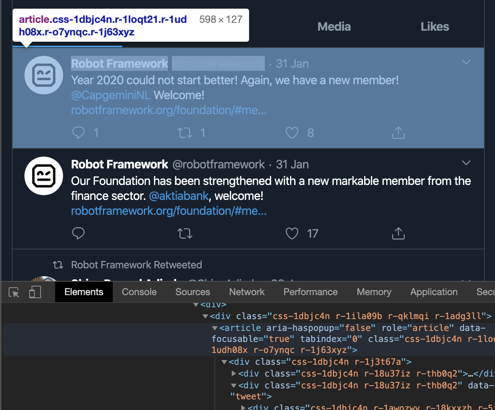
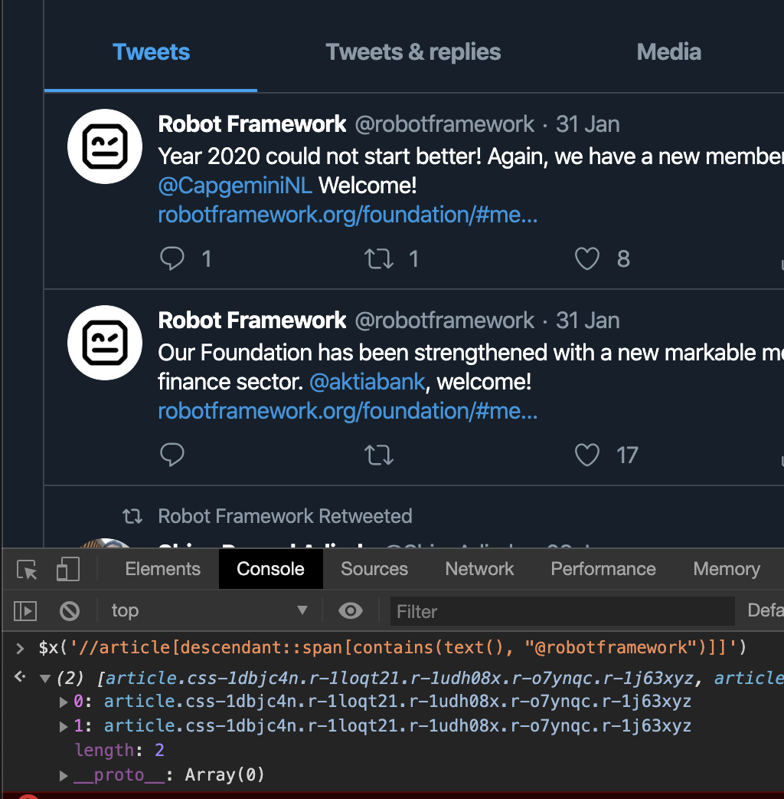

To learn some of the more advanced features of the Robot Framework, you are going to build a web scraper robot.

When run, the robot will:

- open a real web browser
- collect the latest tweets by given Twitter user
- create a file system directory by the name of the Twitter user
- store the text content of each tweet in separate files in the directory
- store a screenshot of each tweet in the directory


## Prerequisites

> To complete this tutorial, you need a working [Python](https://www.python.org/) (version 3) installation. On macOS / Linux, you can open the terminal and try running `python3 --version` to check if you have the required Python installed. On Windows, you can open the command prompt and try running `py --version` to check if you have the required Python installed.

## Create a directory for your software robot projects

Create a directory for your software robot projects. If you already have an existing directory for your projects, you can use that.

## Set up a virtual Python environment

Navigate to your projects directory in the terminal or the command prompt. Set up a virtual Python environment by running the following command:

Windows:

```
py -m venv venv
```

macOS / Linux:

```bash
python3 -m venv venv
```

Activate the Python virtual environment:

Windows:

```
venv\Scripts\activate
```

macOS / Linux:

```bash
. venv/bin/activate
```

## Install Robocode CLI

```bash
pip install robocode
```

## Initialize the software robot directory

```bash
robo init web-scraper-robot
```

Navigate to the directory:

```bash
cd web-scraper-robot
```

## Install RPA Framework

```bash
pip install rpa-framework
```

## Robot task file

Paste the following Robot Framework code in the `tasks/robot.robot` file:

```robot
*** Settings ***
Documentation   Web scraper robot. Stores tweets.
Resource        keywords.robot
Variables       variables.py

*** Tasks ***
Store the latest tweets by given user name
    Store the latest ${NUMBER_OF_TWEETS} tweets by user name "${USER_NAME}"
```

## Robot keywords file

Paste the following Robot Framework code in the `resources/keywords.robot` file:

```robot
*** Settings ***
Library     OperatingSystem
Library     RPA.Browser

*** Keywords ***
Store the latest ${number_of_tweets} tweets by user name "${user_name}"
    Open Twitter homepage   ${user_name}
    Store tweets            ${user_name}    ${number_of_tweets}
    [Teardown]              Close Browser

Open Twitter homepage
    [Arguments]             ${user_name}
    Open Available Browser  ${TWITTER_URL}/${user_name}

Store tweets
    [Arguments]                     ${user_name}            ${number_of_tweets}
    ${tweets_locator}=              Get tweets locator      ${user_name}
    Wait Until Element Is Visible   ${tweets_locator}
    @{tweets}=                      Get WebElements         ${tweets_locator}
    ${tweet_directory}=             Get tweet directory     ${user_name}
    Create Directory                ${tweet_directory}
    ${index}=                       Set Variable            1

    FOR     ${tweet}  IN  @{tweets}
        Exit For Loop If            ${index} > ${number_of_tweets}
        ${screenshot_file}=         Set Variable    ${tweet_directory}/tweet-${index}.png
        ${text_file}=               Set Variable    ${tweet_directory}/tweet-${index}.txt
        ${text}=                    Set Variable    ${tweet.find_element_by_xpath(".//div[@lang='en']").text}
        Capture Element Screenshot  ${tweet}        ${screenshot_file}
        Create File                 ${text_file}    ${text}
        ${index}=                   Evaluate        ${index} + 1
    END

Get tweets locator
    [Arguments]     ${user_name}
    [Return]        xpath://article[descendant::span[contains(text(), "\@${user_name}")]]

Get tweet directory
    [Arguments]     ${user_name}
    [Return]        ${CURDIR}/../output/tweets/${user_name}
```

## Variables file

Paste the following Python code in the `variables/variables.py` file:

```py
NUMBER_OF_TWEETS = 3
TWITTER_URL = "https://twitter.com"
USER_NAME = "robotframework"
```

## Wrap the robot

```bash
robo wrap --force
```

## Run the robot

Windows:

```
robo run entrypoint.cmd
```

macOS / Linux:

```bash
robo run entrypoint.sh
```

The robot should have created a directory `temp/robocode/web-scraper-robot/output/tweets/robotframework` containing images (screenshots of the tweets) and text files (the texts of the tweets).

## Robot script explained

### `web-scraper-robot.robot`

```robot
*** Settings ***
Documentation   Web scraper robot. Stores tweets.
Resource        keywords.robot
Variables       variables.py

*** Tasks ***
Store the latest tweets by given user name
    Store the latest ${NUMBER_OF_TWEETS} tweets by user name "${USER_NAME}"
```

The main robot file (`.robot`) contains the task(s) your robot is going to complete when run.

`Settings` section provides short documentation (`Documentation`) for the script.

`Resource` is used to import a _resource file_. The resource file typically contains the keywords for the robot.

`Variables` is used to import _variables_. The convention is to define the variables using Python (`.py` files).

`Tasks` section defines the tasks for the robot.

`Store the latest tweets by given user name` is the name of the task.

`Store the latest ${NUMBER_OF_TWEETS} tweets by user name "${USER_NAME}"` is a keyword call. The keyword is imported from the `keywords.robot` file where it is implemented.

`${NUMBER_OF_TWEETS}` and `${USER_NAME}` are references to variables defined in the `variables.py` file.

### `keywords.robot`

#### Settings section

```robot
*** Settings ***
Library     OperatingSystem
Library     RPA.Browser
```

`Settings` section imports two _libraries_ using `Library`.

Libraries typically contain Python code that accomplishes tasks, such as creating file system directories and files (`OperatingSystem`) and commanding a web browser (`RPA.Browser`).

The libraries provide _keywords_ that can be used in robot scripts.

#### Keywords section

```robot
*** Keywords ***
Store the latest ${number_of_tweets} tweets by user name "${user_name}"
    Open Twitter homepage   ${user_name}
    Store tweets            ${user_name}    ${number_of_tweets}
    [Teardown]              Close Browser
```

`Keywords` section defines the keywords for the robot.

`Store the latest ${number_of_tweets} tweets by user name "${user_name}"` is a keyword that takes two _arguments_: `${number_of_tweets}` and `${user_name}`.

The keyword is called in the main robot file (`.robot`), providing values for the arguments.

In this case, the default value for the number of tweets is `3`, and the default value for the user name is `robotframework` (see `variables.py`). With those values, the keyword implementation might look like this after Robot Framework has parsed the provided values:

```robot
Store the latest 3 tweets by user name "robotframework"
    Open Twitter homepage   robotframework
    Store tweets            robotframework  3
    [Teardown]              Close Browser
```

Keywords can call other keywords.

`Open Twitter homepage` is another keyword. It takes one argument: `${user_name}`.

`Store tweets` keyword takes two arguments: `${user_name}` and `${number_of_tweets}`.

`[Teardown]` tells Robot Framework to run the given keyword (`Close Browser`) always as the last step. `[Teardown]` will always run, even if the steps before it would fail for any reason.

```robot
Open Twitter homepage
    [Arguments]             ${user_name}
    Open Available Browser  ${TWITTER_URL}/${user_name}
```

`Open Twitter homepage` is one of your keywords. It is not provided by any external library. You can define as many keywords as you need. Your keywords can call other keywords, both your own and keywords provided by libraries.

```robot
    [Arguments]     ${user_name}
```

`[Arguments]` line should be read from left to right. `[Arguments]` line tells Robot Framework the names of the arguments this keyword expects. In this case, there is one argument: `${user_name}`.

```robot
    Open Available Browser  ${TWITTER_URL}/${user_name}
```

`Open Available Browser` is a keyword provided by the `RPA.Browser` library. In this case, you call it with one argument: the URL (`https://twitter.com/robotframework`).

The arguments here reference both a variable (`${TWITTER_URL}`, defined in `variables.py`) and an argument (`${user_name}`, provided when calling your keyword).

```robot
Store tweets
    [Arguments]                     ${user_name}            ${number_of_tweets}
    ${tweets_locator}=              Get tweets locator      ${user_name}
    Wait Until Element Is Visible   ${tweets_locator}
    @{tweets}=                      Get WebElements         ${tweets_locator}
    ${tweet_directory}=             Get tweet directory     ${user_name}
    Create Directory                ${tweet_directory}
    ${index}=                       Set Variable            1

    FOR     ${tweet}  IN  @{tweets}
        Exit For Loop If            ${index} > ${number_of_tweets}
        ${screenshot_file}=         Set Variable    ${tweet_directory}/tweet-${index}.png
        ${text_file}=               Set Variable    ${tweet_directory}/tweet-${index}.txt
        ${text}=                    Set Variable    ${tweet.find_element_by_xpath(".//div[@lang='en']").text}
        Capture Element Screenshot  ${tweet}        ${screenshot_file}
        Create File                 ${text_file}    ${text}
        ${index}=                   Evaluate        ${index} + 1
    END
```

`Store tweets` keyword contains the steps for collecting and storing a screenshot and the text of each tweet.

This keyword could also be provided by a library. Libraries are typically used when the implementation might be complex and would be difficult to implement using Robot Framework syntax. Using ready-made libraries is recommended to avoid unnecessary time spent on implementing your own solution if a ready-made solution exists.

[RPA Framework](https://pypi.org/project/rpa-framework/) provides many open-source libraries for typical RPA (Robotic Process Automation) use cases.

In this example, Robot Framework syntax is used as an example of what kind of "programming" logic is possible with Robot Framework syntax.

More complex business logic is better implemented by taking advantage of libraries (such as `OperatingSystem` and `RPA.Browser` or your own library).

```robot
[Arguments]                     ${user_name}            ${number_of_tweets}
```

`Store tweets` takes two arguments: `${user_name}` and `${number_of_tweets}`.

```robot
${tweets_locator}=              Get tweets locator      ${user_name}
```

A _locator_ (an instruction for the browser to find specific element(s)) is provided by the keyword `Get tweets locator` that takes one argument: `${user_name}`. The computed locator is stored in a _local variable_ `${tweets_locator}`. Having the assignment symbol (`=`) is not required, but including it is a recommended convention for communicating the intent of the assignment.


_Inspecting the DOM to find tweet elements_

In this case the returned locator is an [XPath](https://developer.mozilla.org/en-US/docs/Web/XPath) expression (`//article[descendant::span[contains(text(), "@robotframework")]]`) prefixed by `SeleniumLibrary` specific `xpath:` prefix.

> Tip: You can test XPath expressions in [Firefox](https://www.mozilla.org/en-US/firefox/new/) and in [Chrome](https://www.google.com/chrome/). Right-click on a web page and select `Inspect` or `Inspect Element` to open up the developer tools. Select the `Console` tab. In the console, type `$x('//div')` and hit Enter. The console will display the matched elements (in this case, all the `div` elements). Experiment with your query until it works. You can use the query with `SeleniumLibrary` as an element locator by prefixing the query with `xpath:`.


_Locating elements in browser console with XPath_

```robot
Wait Until Element Is Visible   ${tweets_locator}
```

`Wait Until Element Is Visible` is a keyword provided by the `RPA.Browser` library. It takes a _locator_ as an argument and waits for the element to be visible or until timeout (five seconds by default).

```robot
@{tweets}=                      Get WebElements         ${tweets_locator}
```

`Get WebElements` keyword (`RPA.Browser`) is used to find and return elements matching the given locator argument (`${tweets_locator}`). The elements are stored in a local _list variable_, `@{tweets}`. List variables start with `@` instead of `$`.

```robot
${tweet_directory}=             Get tweet directory     ${user_name}
```

`Get tweet directory` keyword returns a directory path based on the given `${user_name}` argument. The path is stored in a local `${tweet_directory}` variable.

```robot
Create Directory                ${tweet_directory}
```

`Create Directory` keyword is provided by the `OperatingSystem` library. It creates a file system directory based on the given path argument (`${tweet_directory}`).

```robot
${index}=                       Set Variable            1
```

`Set Variable` keyword is used to assign raw values to variables. In this case, a local variable `${index}` is created with the value of `1`. This variable keeps track of the loop index in order to create unique names for the stored files.

```robot
    FOR     ${tweet}  IN  @{tweets}
        ...
    END
```

Robot Framework supports loops using the `FOR` syntax. The found tweet elements are looped, and a set of steps is executed for each tweet.

```robot
Exit For Loop If            ${index} > ${number_of_tweets}
```

`Exit For Loop If` keyword is used to terminate the loop when the given condition returns `True`. In this case, the loop is terminated when the given amount of tweets have been processed.

`Capture Element Screenshot` and `Create File` keywords are used to take a screenshot of each element and to create a text file containing the element text.

```robot
${index}=                   Evaluate        ${index} + 1
```

The previously initialized `${index}` variable is incremented by one at the end of each loop iteration using the `Evaluate` keyword. `Evaluate` takes an _expression_ as an argument and returns the evaluated value.

```robot
Get tweets locator
    [Arguments]     ${user_name}
    [Return]        xpath://article[descendant::span[contains(text(), "\@${user_name}")]]
```

`Get tweets locator` keyword returns an element locator based on the given `${user_name}` argument. Robot Framework uses `[Return]` syntax for returning values.

```robot
Get tweet directory
    [Arguments]     ${user_name}
    [Return]        ${CURDIR}/../output/tweets/${user_name}
```

`Get tweet directory` keyword implementation uses one of the _prefined variables_ in Robot Framework. `${CURDIR}` returns the current working directory.

### `variables.py`

```py
NUMBER_OF_TWEETS = 3
TWITTER_URL = "https://twitter.com"
USER_NAME = "robotframework"
```

Variables are defined using Python by convention.

## Summary

You executed a web scraper robot, congratulations!

During the process, you learned some concepts and features of the Robot Framework and some good practices:

- Defining `Settings` for your script (`*** Settings ***`)
- Documenting scripts (`Documentation`)
- Importing libraries (`OperatingSystem, RPA.Browser`)
- Using keywords provided by libraries (`Open Available Browser`)
- Splitting robot script to multiple files (`*.py`, `*.robot`)
- Creating your own keywords
- Defining arguments (`[Arguments]`)
- Calling keywords with arguments
- Returning values from keywords (`[Return]`)
- Using predefined variables (`${CURDIR}`)
- Using your own variables
- Creating loops with Robot Framework syntax
- Running teardown steps (`[Teardown]`)
- Opening a real browser
- Navigating to web pages
- Locating web elements
- Building and testing locators (`$x('//div')`)
- Scraping text from web elements
- Taking screenshots of web elements
- Creating file system directories
- Creating and writing to files
- Installing Robocode CLI (`pip install robocode`)
- Installing RPA Framework (`pip install rpa-framework`)
- Creating an executable package (`robo wrap`)
- Running robot files (`robo run entrypoint.sh`, `robo run entrypoint.cmd`)
- Organizing your project files in subdirectories (`robo init web-scraper-robot`)
- Using a Python virtual environment (`venv`)
