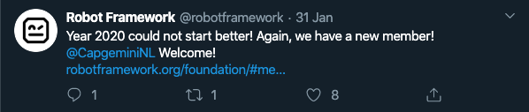

In order to learn some of the more advanced features of the Robot Framework, you are going to build a web scraper robot.

When run, the robot will:

- open a real web browser
- collect the latest tweets by given Twitter user
- create a file system directory by the name of the Twitter user
- store the text content of each tweet in separate files in the directory
- store a screenshot of each tweet in the directory



## Prerequisites

> To complete this tutorial, you need to have [Chrome](https://www.google.com/chrome/) installed. You also need a working [Python](https://www.python.org/) installation. On macOS / Linux, you can open the terminal and try running `python3 --version` to check if you have the required Python installed. On Windows, you can open the command prompt and try running `py --version` to check if you have the required Python installed.

You will start by creating some setup files and scripts to aid with setting up and executing your robot. The scripts will also help other people who want to use your robot to get everything up and running easily.

## Project directory

Create a new `web-scraper-robot` directory. This directory will contain the robot script and other required resources.

## Requirements file

You are going to use several libraries when implementing your robot. To make installing them easier, you are going to provide the list of required libraries in a text file. [pip](https://pypi.org/project/pip/) can read this file and handle the installation for you.

Inside the `web-scraper-robot` directory, create a file by name `requirements.txt`. Paste the following libraries in the file:

```
robotframework
robotframework-seleniumlibrary
webdrivermanager
```

## Installation script: macOS / Linux

Inside the `web-scraper-robot` directory, create a new `scripts` directory. This directory will contain the scripts for setting up and running your robot.

In the `scripts` directory, create a file by name `prepare.sh`. Paste the following _shell script_ in the `prepare.sh` file:

```bash
#!/bin/bash

if [[ $# -eq 0 ]] ; then
    export browser=chrome
else
    export browser=$1
fi

python3 -m venv venv
. venv/bin/activate

pip install --upgrade wheel pip setuptools
pip install -r requirements.txt

webdrivermanager $browser
```

Save the shell script.

Make sure the shell script has _execution permissions_ by running the following command in the terminal:

```bash
chmod u+x prepare.sh
```

Your directory structure should look like this:

```bash
web-scraper-robot
├── requirements.txt
└── scripts
    └── prepare.sh
```

Navigate to the `web-scraper-robot` directory.

Execute the installation script to setup required libraries and drivers by running the following command:

```bash
./scripts/prepare.sh
```

The example output should look similar to this (cropped):

```bash
$ ./scripts/prepare.sh
Collecting wheel
  Using cached https://files.pythonhosted.org/packages/8c/23/848298cccf8e40f5bbb59009b32848a4c38f4e7f3364297ab3c3e2e2cd14/wheel-0.34.2-py2.py3-none-any.whl
Collecting pip
  Using cached https://files.pythonhosted.org/packages/54/0c/d01aa759fdc501a58f431eb594a17495f15b88da142ce14b5845662c13f3/pip-20.0.2-py2.py3-none-any.whl
...
...
Downloading WebDriver for browser: "chrome"
6839kb [00:01, 5909.24kb/s]
Driver binary downloaded to: "/your-projects-directory/web-scraper-robot/venv/WebDriverManager/chrome/80.0.3987.16/chromedriver_mac64/chromedriver"
Symlink created: /your-projects-directory/web-scraper-robot/venv/bin/chromedriver
```

## Run script: macOS / Linux

To make running your robot easier, you are going to create a shell script for that purpose.

Inside the `scripts` directory, create a file by name `run.sh` and paste in the following shell script:

```bash
#!/bin/bash

. venv/bin/activate

python -m robot -d output -P resources -P variables --logtitle "Task log" tasks/

```

Make sure the shell script has execution permissions by running the following command in the terminal:

```bash
chmod u+x run.sh
```

## Installation script: Windows

Inside the `web-scraper-robot` directory, create a new `scripts` directory. This directory will contain the scripts for setting up and running your robot.

In the `scripts` directory, create a file by name `prepare.bat`. Paste the following _Windows batch script_ in the `prepare.bat` file:

```batch
py -m venv venv
call venv\Scripts\activate

python -m pip install --upgrade pip
pip install -r requirements.txt
webdrivermanager chrome

call venv\Scripts\deactivate

```

Save the batch script.

Your directory structure should look like this:

```bash
web-scraper-robot
├── requirements.txt
└── scripts
    └── prepare.bat
```

Navigate to the `web-scraper-robot` directory.

Execute the installation script to setup required libraries and drivers by running the following command:

```
scripts\prepare.bat
```

## Run script: Windows

To make running your robot easier, you are going to create a Windows batch script for that purpose.

Inside the `scripts` directory, create a file by name `run.bat` and paste in the following Windows batch script:

```batch
call venv\Scripts\activate

python -m robot -d output -P libraries -P resources -P variables --logtitle "Task log" tasks/

call venv\Scripts\deactivate

```

## Robot script

Inside the `web-scraper-robot` directory, create a directory by name `tasks`.

Inside the `tasks` directory, create a file by name `web-scraper-robot.robot`.

Paste the following Robot Framework code in the `web-scraper-robot.robot` file:

```robot
*** Settings ***
Documentation   Web scraper robot. Stores tweets.
Resource        keywords.resource
Variables       variables.py

*** Tasks ***
Store the latest tweets by given user name
    Store the latest ${NUMBER_OF_TWEETS} tweets by user name "${USER_NAME}"
```

## Keywords resource file

Inside the `web-scraper-robot` directory, create a directory by name `resources`.

Inside the `resources` directory, create a file by name `keywords.resource`.

Paste the following Robot Framework code in the `keywords.resource` file:

```robot
*** Settings ***
Library     OperatingSystem
Library     SeleniumLibrary

*** Keywords ***
Store the latest ${number_of_tweets} tweets by user name "${user_name}"
    Open Twitter homepage   ${user_name}
    Store tweets            ${user_name}    ${number_of_tweets}
    [Teardown]              Close Browser

Open Twitter homepage
    [Arguments]     ${user_name}
    Open Browser    ${TWITTER_URL}/${user_name}  ${BROWSER}

Store tweets
    [Arguments]                     ${user_name}            ${number_of_tweets}
    ${tweets_locator}=              Get tweets locator      ${user_name}
    Wait Until Element Is Visible   ${tweets_locator}
    @{tweets}=                      Get WebElements         ${tweets_locator}
    ${tweet_directory}=             Get tweet directory     ${user_name}
    Create Directory                ${tweet_directory}
    ${index}=                       Set Variable            1

    FOR     ${tweet}  IN  @{tweets}
        Exit For Loop If            ${index} > ${number_of_tweets}
        ${screenshot_file}=         Set Variable    ${tweet_directory}/tweet-${index}.png
        ${text_file}=               Set Variable    ${tweet_directory}/tweet-${index}.txt
        ${text}=                    Set Variable    ${tweet.find_element_by_xpath(".//div[@lang='en']").text}
        Capture Element Screenshot  ${tweet}        ${screenshot_file}
        Create File                 ${text_file}    ${text}
        ${index}=                   Evaluate        ${index} + 1
    END

Get tweets locator
    [Arguments]     ${user_name}
    [Return]        xpath://article[descendant::span[contains(text(), "\@${user_name}")]]

Get tweet directory
    [Arguments]     ${user_name}
    [Return]        ${CURDIR}/tweets/${user_name}
```

## Variables file

Inside the `web-scraper-robot` directory, create a directory by name `variables`.

Inside the `variables` directory, create a file by name `variables.py`.

Paste the following Python code in the `variables.py` file:

```py
BROWSER = "Chrome"
NUMBER_OF_TWEETS = 3
TWITTER_URL = "https://twitter.com"
USER_NAME = "robotframework"
```

## Running the robot

Your directory structure should look like this:

```bash
web-scraper-robot
├── requirements.txt
├── resources
│   └── keywords.resource
├── scripts
│   ├── prepare.sh (or prepare.bat)
│   └── run.sh (or run.bat)
├── tasks
│   └── web-scraper-robot.robot
└── variables
    └── variables.py
```

In the terminal, navigate to the `web-scraper-robot` directory and execute (run) the robot:

macOS / Linux:

```bash
./scripts/run.sh
```

Windows:

```
scripts\run.bat
```

The example output might look something like the following:

```bash
==============================================================================
Web-Scraper-Robot :: Web scraper robot. Stores tweets.
==============================================================================
Store the latest tweets by given user name                            | PASS |
------------------------------------------------------------------------------
Web-Scraper-Robot :: Web scraper robot. Stores tweets.                | PASS |
1 critical task, 1 passed, 0 failed
1 task total, 1 passed, 0 failed
==============================================================================
Output:  /your-projects-directory/web-scraper-robot/output/output.xml
Log:     /your-projects-directory/web-scraper-robot/output/log.html
Report:  /your-projects-directory/web-scraper-robot/output/report.html
```

The robot should have created a directory `tweets/robotframework` containing images (screenshots of the tweets) and text files (the texts of the tweets).

## Robot script explained

### `web-scraper-robot.robot`

```robot
*** Settings ***
Documentation   Web scraper robot. Stores tweets.
Resource        keywords.resource
Variables       variables.py

*** Tasks ***
Store the latest tweets by given user name
    Store the latest ${NUMBER_OF_TWEETS} tweets by user name "${USER_NAME}"
```

The main robot file (`.robot`) contains the task(s) your robot is going to complete when run.

`Settings` section provides short documentation (`Documentation`) for the script.

`Resource` is used to import a _resource file_. The resource file typically contains the keywords for the robot.

`Variables` is used to import _variables_. The convention is to define the variables using Python (`.py` files).

`Tasks` section defines the tasks for the robot.

`Store the latest tweets by given user name` is the name of the task.

`Store the latest ${NUMBER_OF_TWEETS} tweets by user name "${USER_NAME}"` is a keyword call. The keyword is imported from the `keywords.resource` file where it is implemented.

`${NUMBER_OF_TWEETS}` and `${USER_NAME}` are references to variables defined in the `variables.py` file.

### `keywords.resource`

#### Settings section

```robot
*** Settings ***
Library     OperatingSystem
Library     SeleniumLibrary
```

`Settings` section imports two _libraries_ using `Library`.

Libraries typically contain Python code that accomplish tasks, such as creating file system directories and files (`OperatingSystem`) and commanding a web browser (`SeleniumLibrary`).

The libraries provide _keywords_ that can be used in robot scripts.

#### Keywords section

```robot
*** Keywords ***
Store the latest ${number_of_tweets} tweets by user name "${user_name}"
    Open Twitter homepage   ${user_name}
    Store tweets            ${user_name}    ${number_of_tweets}
    [Teardown]              Close Browser
```

`Keywords` section defines the keywords for the robot.

`Store the latest ${number_of_tweets} tweets by user name "${user_name}"` is a keyword that takes two _arguments_: `${number_of_tweets}` and `${user_name}`.

The keyword is called in the main robot file (`.robot`), providing values for the arguments.

In this case the default value for the number of tweets is `3` and the default value for the user name is `robotframework` (see `variables.py`). Using those values, the keyword implementation might look like this after Robot Framework has parsed the provided values:

```robot
Store the latest 3 tweets by user name "robotframework"
    Open Twitter homepage   robotframework
    Store tweets            robotframework  3
    [Teardown]              Close Browser
```

Keywords can call other keywords.

`Open Twitter homepage` is another keyword. It takes one argument: `${user_name}`.

`Store tweets` keyword takes two arguments: `${user_name}` and `${number_of_tweets}`.

`[Teardown]` tells Robot Framework to run the given keyword (`Close Browser`) always as the last step. `[Teardown]` will always run, even if the steps before it would fail for any reason.

```robot
Open Twitter homepage
    [Arguments]     ${user_name}
    Open Browser    ${TWITTER_URL}/${user_name}  ${BROWSER}
```

`Open Twitter homepage` is one of your own keywords. It is not provided by any external library. You can define as many keywords as you need. Your keywords can call other keywords, both your own and keywords provided by libraries.

```robot
    [Arguments]     ${user_name}
```

`[Arguments]` line should be read from left to right. `[Arguments]` line tells Robot Framework the names of the arguments this keyword expects. In this case there is one argument: `${user_name}`.

```robot
    Open Browser    ${TWITTER_URL}/${user_name}  ${BROWSER}
```

`Open Browser` is a keyword provided by the `SeleniumLibrary`. In this case you call it with two arguments: the URL (`https://twitter.com/robotframework`) and the browser (`Chrome`).

The arguments here reference both variables (`${TWITTER_URL}` and `${BROWSER}`, defined in `variables.py`) and an argument (`${user_name}`, provided when calling your keyword).

```robot
Store tweets
    [Arguments]                     ${user_name}            ${number_of_tweets}
    ${tweets_locator}=              Get tweets locator      ${user_name}
    Wait Until Element Is Visible   ${tweets_locator}
    @{tweets}=                      Get WebElements         ${tweets_locator}
    ${tweet_directory}=             Get tweet directory     ${user_name}
    Create Directory                ${tweet_directory}
    ${index}=                       Set Variable            1

    FOR     ${tweet}  IN  @{tweets}
        Exit For Loop If            ${index} > ${number_of_tweets}
        ${screenshot_file}=         Set Variable    ${tweet_directory}/tweet-${index}.png
        ${text_file}=               Set Variable    ${tweet_directory}/tweet-${index}.txt
        ${text}=                    Set Variable    ${tweet.find_element_by_xpath(".//div[@lang='en']").text}
        Capture Element Screenshot  ${tweet}        ${screenshot_file}
        Create File                 ${text_file}    ${text}
        ${index}=                   Evaluate        ${index} + 1
    END
```

`Store tweets` keyword contains the steps for collecting and storing a screenshot and the text of each tweet.

This keyword could also be provided by a library. Libraries are typically used when the implementation might be complex and would be difficult to implement using Robot Framework syntax. Using ready-made libraries is recommended to avoid unnecessary time spent on implementing your own solution if a ready-made solution exists.

Robocorp provides many open-source libraries for typical RPA (Robotic Process Automation) use cases.

In this example, Robot Framework syntax is used as an example of what kind of "programming" logic is possible with Robot Framework syntax.

More complex business logic is better implemented taking advantage of libraries (such as `OperatingSystem` and `SeleniumLibrary` or your own library).

```robot
[Arguments]                     ${user_name}            ${number_of_tweets}
```

`Store tweets` takes two arguments: `${user_name}` and `${number_of_tweets}`.

```robot
${tweets_locator}=              Get tweets locator      ${user_name}
```

A _locator_ (an instruction for the browser to find specific element(s)) is provided by the keyword `Get tweets locator` that takes one argument: `${user_name}`. The computed locator is stored in a _local variable_ `${tweets_locator}`. Having the assignment symbol (`=`) is not required, but including it is a recommended convention for communicating the intent of assignment.


_Inspecting the DOM to find tweet elements_

In this case the returned locator is an [XPath](https://developer.mozilla.org/en-US/docs/Web/XPath) expression (`//article[descendant::span[contains(text(), "@robotframework")]]`) prefixed by `SeleniumLibrary` specific `xpath:` prefix.

> Tip: You can test XPath expressions in [Firefox](https://www.mozilla.org/en-US/firefox/new/) and in [Chrome](https://www.google.com/chrome/). Right click on a web page and select `Inspect` or `Inspect Element` to open up the developer tools. Select the `Console` tab. In the console, type `$x('//div')` and hit Enter. The console will display the matched elements (in this case all the `div` elements). Experiment with your query until it works. You can use the query with `SeleniumLibrary` as an element locator by prefixing the query with `xpath:`.


_Locating elements in browser console with XPath_

```robot
Wait Until Element Is Visible   ${tweets_locator}
```

`Wait Until Element Is Visible` is a keyword provided by the `SeleniumLibrary`. It takes a _locator_ as an argument and waits for the element to be visible or until timeout (five seconds by default).

```robot
@{tweets}=                      Get WebElements         ${tweets_locator}
```

`Get WebElements` keyword (`SeleniumLibrary`) is used to find and return elements matching the given locator argument (`${tweets_locator}`). The elements are stored in a local _list variable_, `@{tweets}`. List variables start with `@` instead of `$`.

```robot
${tweet_directory}=             Get tweet directory     ${user_name}
```

`Get tweet directory` keyword returns a directory path based on the given `${user_name}` argument. The path is stored in a local `${tweet_directory}` variable.

```robot
Create Directory                ${tweet_directory}
```

`Create Directory` keyword is provided by the `OperatingSystem` library. It creates a file system directory based on the given path argument (`${tweet_directory}`).

```robot
${index}=                       Set Variable            1
```

`Set Variable` keyword is used to assign raw values to variables. In this case a local variable `${index}` is created with the value of `1`. This variable keeps track of the loop index in order to create unique names for the stored files.

```robot
    FOR     ${tweet}  IN  @{tweets}
        ...
    END
```

Robot Framework supports loops using the `FOR` syntax. The found tweet elements are looped and a set of steps is executed for each tweet.

```robot
Exit For Loop If            ${index} > ${number_of_tweets}
```

`Exit For Loop If` keyword is used to terminate the loop when the given condition returns `True`. In this case the loop is terminated when the given amount of tweets have been processed.

`Capture Element Screenshot` and `Create File` keywords are used to take a screenshot of each element and to create a text file containing the element text.

```robot
${index}=                   Evaluate        ${index} + 1
```

The previously initialized `${index}` variable is incremented by one at the end of each loop iteration using the `Evaluate` keyword. `Evaluate` takes an _expression_ as an argument and returns the evaluated value.

```robot
Get tweets locator
    [Arguments]     ${user_name}
    [Return]        xpath://article[descendant::span[contains(text(), "\@${user_name}")]]
```

`Get tweets locator` keyword returns an element locator based on the given `${user_name}` argument. Robot Framework uses `[Return]` syntax for returning values.

```robot
Get tweet directory
    [Arguments]     ${user_name}
    [Return]        ${CURDIR}/tweets/${user_name}
```

`Get tweet directory` keyword implementation uses one of the _prefined variables_ in Robot Framework. `${CURDIR}` returns the current working directory.

### `variables.py`

```py
BROWSER = "Chrome"
NUMBER_OF_TWEETS = 3
TWITTER_URL = "https://twitter.com"
USER_NAME = "robotframework"
```

Variables are defined using Python by convention. Variables can be overridden when executing your robot.

Run the following command in terminal:

macOS / Linux:

```bash
python3 -m robot --variable USER_NAME:SeleniumHQ tasks/
```

Windows:

```
py -m robot --variable USER_NAME:SeleniumHQ tasks/
```

`--variable USER_NAME:SeleniumHQ` tells Robot Framework to override the `USER_NAME` variable with the value of `SeleniumHQ`.

Using variables in robot scripts is useful when you want to provide a way to change the values without altering the robot scripts. This way the same script could use different URLs in different environments, or in this case, store tweets by any user name.

## Summary

You executed a web scraper robot, congratulations!

During the process, you learned some concepts and features of the Robot Framework:

- [x] Defining `Settings` for your script (`*** Settings ***`)
- [x] Documenting scripts (`Documentation`)
- [x] Importing libraries (`OperatingSystem, SeleniumLibrary`)
- [x] Using keywords provided by libraries (`Open Browser`)
- [x] Splitting robot script to multiple files (`*.py`, `*.resource`, `*.robot`)
- [x] Creating your own keywords
- [x] Defining arguments (`[Arguments]`)
- [x] Calling keywords with arguments
- [x] Returning values from keywords (`[Return]`)
- [x] Using predefined variables (`${CURDIR}`)
- [x] Using your own variables
- [x] Overriding variables (from command line)
- [x] Creating loops with Robot Framework syntax
- [x] Running teardown steps (`[Teardown]`)
- [x] Opening a real browser
- [x] Navigating to web pages
- [x] Locating web elements
- [x] Building and testing locators (`$x('//div')`)
- [x] Scraping text from web elements
- [x] Taking screenshots of web elements
- [x] Creating file system directories
- [x] Creating and writing to files
- [x] Defining library dependencies (`requirements.txt`)
- [x] Using an installation script to ease installation (`scripts/prepare.sh`, `scripts/prepare.bat`)
- [x] Using a run script to ease execution (`scripts/run.sh`, `scripts/run.bat`)
- [x] Organizing your project files in subdirectories
